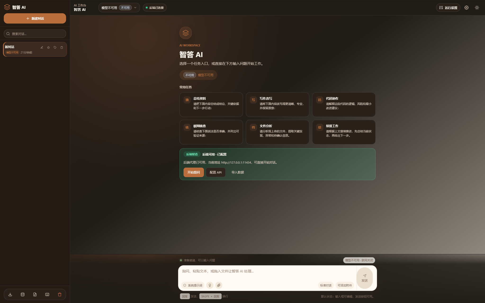
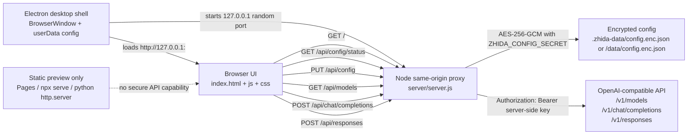

# 智答 AI

<p align="center">
  
</p>

<p align="center">
  <strong>本地优先、同源代理、可作为 Windows 桌面应用运行的 AI 对话工作台。</strong><br>
  支持 OpenAI-compatible Chat Completions / Responses、多模型会话、联网搜索、流式输出、文件输入和安全的服务端/桌面端密钥保存。
</p>

<p align="center">
  <a href="https://github.com/ShuaiShuai03/zhida-ai/actions/workflows/ci.yml"></a>
  <a href="LICENSE"></a>
  
  
  
</p>

> [!IMPORTANT]
> 智答 AI 的安全边界是服务端代理。浏览器只访问同源 `/api/*` 路由；API key 不会写入 `localStorage`、前端请求头、备份 JSON、静态托管配置或公开仓库。

<p align="center">
  
</p>

## 目录

- [为什么是智答 AI](#为什么是智答-ai)
- [核心特性](#核心特性)
- [适用场景](#适用场景)
- [快速开始](#快速开始)
- [Windows 桌面应用](#windows-桌面应用)
- [安全模型](#安全模型)
- [架构与请求流](#架构与请求流)
- [Docker 部署](#docker-部署)
- [环境变量](#环境变量)
- [数据、模型与输入](#数据模型与输入)
- [质量检查](#质量检查)
- [项目结构](#项目结构)
- [常见问题](#常见问题)

## 为什么是智答 AI

| 设计目标 | 实际收益 |
| --- | --- |
| **本地优先** | 会话、标签、模板、非敏感偏好保存在浏览器本地，适合个人和小团队自托管。 |
| **密钥不进前端** | API 地址和密钥只提交给同源 Node 后端，加密保存后由服务端转发请求。 |
| **无需前端构建链路** | 前端是原生 HTML/CSS/ES Modules；开发和部署时不需要 Vite、Webpack 或 npm build。 |
| **兼容 OpenAI 风格接口** | 支持 `/v1/models`、`/v1/chat/completions`、`/v1/responses` 和 SSE 流式输出。 |
| **体验接近桌面工作台** | 暖色 Claude-style 界面、会话侧边栏、运行设置抽屉、文件队列、模板和快捷键都在一个页面内完成。 |

## 核心特性

### 对话与模型

- 多轮上下文对话，支持流式输出、停止生成、重新生成、追问和分段导出。
- 从已配置上游的 `/v1/models` 获取模型列表，不在仓库中硬编码模型。
- 每个会话保存自己的模型选择，切换历史会话时不会被当前模型静默覆盖。
- 识别模型能力后启用或禁用 Responses、网络搜索、搜索范围和推理深度控件。
- 历史会话模型不可用时显示明确状态，要求用户重新选择可用模型。

### 输入与内容处理

- 支持文本、长文本自动转 Markdown 附件、图片、代码文件、拖拽上传和粘贴图片。
- 附件队列显示文件名、类型、移除按钮、长文本发送模式和下载入口。
- 支持 Markdown、代码高亮、表格、LaTeX、思考过程折叠展示和 URL citation 来源链接。
- 输入框保留三种状态：默认输入、文件上传、生成中停止。
- 移动端输入框切为单列布局，发送/停止按钮下沉为全宽按钮，附件 chip 不产生横向溢出。

### 工作流与数据管理

- 会话支持搜索、置顶、标签、重命名、删除和清空。
- 提供内置提示词模板，并支持自定义模板增删改。
- 单会话可导出 Markdown；全部本地数据可导出 JSON 备份。
- 备份包含会话、当前激活会话、模型选择、模型缓存、非敏感设置、自定义模板和 BJT 导出时间。
- 备份不包含 API key。

### 安全与部署

- Node 后端同源代理转发上游请求，浏览器不会直接访问上游 API。
- `PUT /api/config` 使用 `ZHIDA_CONFIG_SECRET` 派生 AES-256-GCM 密钥保存配置。
- Windows 桌面模式使用 Electron 启动内部 `127.0.0.1` loopback 代理，不通过 `file://` 加载应用。
- 桌面配置写入 Windows 用户数据目录，并使用 Electron `safeStorage` 保护本机安装级密钥。
- 默认本地监听 `127.0.0.1`；Docker 代理默认只发布到宿主机回环地址。
- 静态模式只用于界面预览，不提供真实聊天能力。
- `/tests/smoke.html` 默认不暴露，只有 `ZHIDA_ENABLE_TEST_ROUTES=1` 时开放。

## 适用场景

| 场景 | 可以完成什么 |
| --- | --- |
| **个人 AI 工作台** | 在本地保存会话、模板、标签和模型偏好，用一个安全入口访问不同 OpenAI-compatible 服务。 |
| **代码协作** | 上传代码或粘贴片段，让模型解释逻辑、识别风险、生成最小改动建议。 |
| **资料整理** | 上传 Markdown、CSV、日志或截图，生成摘要、关键结论、待确认问题和下一步行动。 |
| **联网核查** | 在支持 Responses 的模型上启用网络搜索，并保留 citation 来源链接。 |
| **私有模型前端** | 连接本地 Ollama、企业代理或其他兼容 OpenAI API 的服务。 |
| **轻量团队内网工具** | 使用 Docker 代理部署到受控内网，配合 HTTPS、鉴权和限流作为团队入口。 |

## 快速开始

### 1. 克隆仓库

```bash
git clone https://github.com/ShuaiShuai03/zhida-ai.git
cd zhida-ai
```

### 2. 启动 Node 后端代理

```bash
ZHIDA_CONFIG_SECRET="change-this-to-a-long-random-secret" \
ZHIDA_PORT=3000 \
node server/server.js
```

也可以使用启动脚本：

```bash
ZHIDA_CONFIG_SECRET="change-this-to-a-long-random-secret" bash scripts/start.sh 3000
```

### 3. 配置上游 API

打开 `http://localhost:3000`，进入右上角 **设置**，填写 API 地址和 API 密钥，然后点击 **保存配置并获取模型列表**。

| 字段 | 说明 | 示例 |
| --- | --- | --- |
| API 地址 | OpenAI-compatible 接口基础 URL，可带或不带 `/v1` | `https://api.openai.com` 或 `https://api.openai.com/v1` |
| API 密钥 | 服务端代理访问上游 API 使用；保存后输入框会清空 | `sk-...` |
| 系统提示词 | 自定义模型行为 | `你是一个严谨的代码审查助手。` |
| 温度 | 控制输出随机性 | `0.7` |
| 最大回复长度 | 限制单次回复 token 数 | `4096` |

> [!TIP]
> API 地址会在后端归一化，`https://api.openai.com` 和 `https://api.openai.com/v1` 都会正确映射到 `/v1/*` 上游路径。

## Windows 桌面应用

桌面壳使用 Electron + electron-builder。它不会用 `file://` 打开页面，而是在应用启动时创建内部 Node 同源代理，绑定到 `127.0.0.1` 的随机端口，然后加载 `http://127.0.0.1:<port>/?desktop=1`。这样现有 `/api/*` 安全边界、流式响应、停止生成、模型列表和配置保存逻辑都保持一致。

### 开发启动

桌面开发和打包使用 Electron `42.4.1`，需要 Node.js `22.12.0` 或更高版本；纯 Web/server 模式仍按 CI 覆盖 Node 20 和 Node 22。

```powershell
npm install
npm run desktop
```

默认窗口大小为 `1440x900`，最小窗口为 `1280x800`。桌面模式会启用更接近 Windows productivity app 的工作区外壳，但仍使用真实的 `index.html`、`css/*.css` 和 `js/*.js` 功能代码。

### 打包

```powershell
# 生成未安装的应用目录，适合本地验收
npm run desktop:dir

# 生成 Windows x64 NSIS 安装包
npm run desktop:build
```

electron-builder 的打包白名单只包含运行所需的前端、server 和 desktop 文件，并显式排除 `.env`、`.zhida-data/`、`server/data/`、`*.enc.json`、日志、测试和开发资料。

### 桌面安全模型

- API key 仍只提交给同源后端代理，不进入 `localStorage`、前端请求头、导出 JSON、日志或静态资源。
- 桌面模式把加密配置保存到 Electron `userData` 目录下的 `config.enc.json`，不写入仓库。
- 用于保护配置的本机安装级密钥保存为 `desktop-secret.enc.json`，内容由 Electron `safeStorage` 保护；Windows 上由系统加密能力提供保护。
- Renderer 关闭 Node integration，启用 context isolation、sandbox 和 webSecurity；外部导航会被拦截并交给系统浏览器。

## 安全模型

> [!CAUTION]
> GitHub Pages、`npx serve . -p 3000`、`python3 -m http.server 3000` 和任何纯静态托管都不能隐藏 API key，也没有 `/api/config/status`、`PUT /api/config`、`/api/models`、`/api/chat/completions`、`/api/responses` 或 Responses 取消能力。它们只适合查看界面；真实聊天必须运行 Node 后端代理。

| 边界 | 当前行为 |
| --- | --- |
| 浏览器请求范围 | 浏览器只请求同源后端路由，不直接访问上游 API。 |
| API key 存储 | API key 不进入 `localStorage`、前端请求头、备份 JSON 或静态资源。 |
| 配置保存 | `PUT /api/config` 把 API 地址和密钥提交给同源 Node 后端。 |
| 服务端加密 | 后端使用 `ZHIDA_CONFIG_SECRET` 派生 AES-256-GCM 密钥保存本地配置。 |
| 桌面端配置 | Electron 使用 `safeStorage` 保护本机安装级密钥，并把配置写入 Windows 用户数据目录。 |
| 默认监听 | 本地默认绑定 `127.0.0.1`。 |
| Docker 暴露 | `docker-compose.proxy.yml` 默认发布到 `${ZHIDA_HOST_IP:-127.0.0.1}:${ZHIDA_HOST_PORT:-3000}`。 |
| 静态资源白名单 | 服务端配置文件、后端源码、隐藏路径和测试页默认不会作为静态资源公开。 |
| Markdown 清洗 | 自定义 HTML 清洗器移除危险标签、危险属性和 unsafe inline style。 |

拥有服务器进程权限和 `ZHIDA_CONFIG_SECRET` 的人可以解密本地配置文件。生产部署应使用足够长且随机的 `ZHIDA_CONFIG_SECRET`，并通过 HTTPS 提交配置。

## 架构与请求流

Web 模式可以直接运行 `server/server.js`。桌面模式复用同一个 server 生命周期 API，由 Electron 主进程先启动内部 loopback 代理，再加载同源 HTTP 页面。



### API 路由映射

| 浏览器请求 | 上游请求 | 说明 |
| --- | --- | --- |
| `GET /api/config/status` | 本地配置状态 | 只返回脱敏状态，不返回密钥。 |
| `PUT /api/config` | 本地加密保存 | 保存 API 地址和密钥，要求 `ZHIDA_CONFIG_SECRET`。 |
| `GET /api/models` | `${apiBaseUrl}/v1/models` | 获取模型列表。 |
| `POST /api/chat/completions` | `${apiBaseUrl}/v1/chat/completions` | 普通聊天和流式响应。 |
| `POST /api/responses` | `${apiBaseUrl}/v1/responses` | Responses、网络搜索和推理深度。 |
| `POST /api/responses/:id/cancel` | `${apiBaseUrl}/v1/responses/:id/cancel` | 取消 Responses 请求。 |

## Docker 部署

### 后端代理模式

```bash
ZHIDA_CONFIG_SECRET="change-this-to-a-long-random-secret" \
docker compose -f docker-compose.proxy.yml up -d
```

访问 `http://localhost:3000` 后在设置中填写 API 地址和密钥。

| 项目 | 默认行为 |
| --- | --- |
| 容器镜像 | `Dockerfile.server`，运行 `server/server.js`。 |
| 容器监听 | 镜像内 `ZHIDA_HOST=0.0.0.0`，只表示容器内部监听全部接口。 |
| 宿主机暴露 | Compose 默认 `${ZHIDA_HOST_IP:-127.0.0.1}:${ZHIDA_HOST_PORT:-3000}:3000`。 |
| 配置持久化 | Docker 卷 `zhida-ai-config` 挂载到 `/data`。 |
| 配置路径 | `/data/config.enc.json`。 |

> [!WARNING]
> 如果设置 `ZHIDA_HOST_IP=0.0.0.0`，宿主机所有网卡都会暴露该端口。公开部署前请放在带认证、限流和 HTTPS 的反向代理之后。

### 静态预览模式

```bash
docker compose up -d
```

`Dockerfile` 和 `docker-compose.yml` 提供的是 Nginx 静态页面预览，不提供同源 `/api/*` 后端能力，不能保存或隐藏 API key，也不能用于真实聊天。

## 环境变量

| 变量 | 是否必填 | 默认 | 说明 |
| --- | --- | --- | --- |
| `ZHIDA_CONFIG_SECRET` | 是 | 无 | API 配置加密密钥；生产环境建议使用至少 16 字符的随机值。 |
| `ZHIDA_HOST` | 否 | 本地 `127.0.0.1`；Docker `0.0.0.0` | Node 后端监听地址。 |
| `ZHIDA_PORT` | 否 | `3000` | Node 后端监听端口；服务端读取的是 `ZHIDA_PORT`，不是 `PORT`。 |
| `ZHIDA_CONFIG_PATH` | 否 | 本地 `.zhida-data/config.enc.json`；Docker `/data/config.enc.json` | 加密配置文件路径。 |
| `LEGACY_DOCKER_CONFIG_PATH` | 否 | `server/data/config.enc.json` | 旧 Docker 配置只读兼容路径。 |
| `ZHIDA_PROXY_TIMEOUT_MS` | 否 | `120000` | 上游代理超时，单位毫秒。 |
| `ZHIDA_PROXY_MAX_BODY_BYTES` | 否 | 服务端 `26214400`；Compose `10485760` | `/api/chat/completions` 和 `/api/responses` 请求体上限。 |
| `ZHIDA_ENABLE_TEST_ROUTES` | 否 | 未启用 | 只有字面量 `1` 会开放 `/tests/smoke.html`。 |
| `ZHIDA_HOST_IP` | 否；仅 Compose | `127.0.0.1` | Docker Compose 发布到宿主机的绑定 IP。 |
| `ZHIDA_HOST_PORT` | 否；仅 Compose | `3000` | Docker Compose 暴露到宿主机的端口。 |
| `NODE_VERSION` | 否；仅 Docker 构建 | `22` | `Dockerfile.server` 的 Node 基础镜像版本构建参数。 |

## 数据、模型与输入

### 模型能力规则

- 网络搜索使用 Responses API 的 `web_search` 工具。
- 搜索范围可选 `low`、`medium`、`high`，默认 `medium`。
- 如果 `/v1/models` 返回 `call_methods`、`callMethods` 或 `capabilities.call_methods`，应用以该字段判断是否支持 Responses。
- 如果模型没有声明能力，应用会先乐观使用 Responses；首次收到能力错误后会缓存该模型不支持 Responses，并自动重试 Chat Completions。
- GPT-5 系列、o 系列、thinking/reasoner/deep-think 命名模型，或显式声明 reasoning 能力的模型，会显示“思考深度”控件。
- 推理深度可选 `none`、`minimal`、`low`、`medium`、`high`、`xhigh`，默认 `medium`。

### 文件与图片上传

| 类型 | 支持内容 | 限制 |
| --- | --- | --- |
| 文本 / 代码文件 | `.txt`、`.md`、`.js`、`.ts`、`.jsx`、`.tsx`、`.py`、`.json`、`.csv`、`.html`、`.css`、`.xml`、`.yaml`、`.yml`、`.sh`、`.bat`、`.ps1`、`.sql`、`.go`、`.rs`、`.java`、`.c`、`.cpp`、`.h`、`.rb`、`.php`、`.log`、`.conf`、`.ini`、`.toml`、`.env`、`.swift`、`.kt`、`.scala`、`.r` | 单个不超过 `100 KB` |
| 图片 | `.png`、`.jpg`、`.jpeg`、`.gif`、`.webp`、`.bmp`、`.svg` | 单个不超过 `5 MB` |

### 快捷键

| 快捷键 | 功能 |
| --- | --- |
| `Enter` | 发送消息 |
| `Shift + Enter` | 换行 |
| `Ctrl/Cmd + N` | 新建对话 |
| `Ctrl/Cmd + Shift + S` | 切换侧边栏 |
| `Ctrl/Cmd + Shift + L` | 切换主题 |
| `Esc` | 关闭弹窗 / 停止生成 |
| 双击对话标题 | 重命名对话 |

## 质量检查

```bash
# 文档和链接校验
python3 scripts/check_markdown.py

# JavaScript 语法校验
for f in js/*.js desktop/*.js server/server.js; do node --check "$f"; done

# Shell 与 Python 脚本校验
bash -n scripts/start.sh scripts/run_smoke.sh
python3 -m py_compile scripts/check_markdown.py scripts/mock_api.py

# 纯逻辑和服务端单测
node --test tests/*.test.mjs

# 桌面打包配置检查
npm run desktop:dir

# 浏览器 smoke，需要本机可执行 google-chrome
bash scripts/run_smoke.sh

# Git 空白检查
git diff --check
```

浏览器 smoke 会启动本地 Node 后端和 mock API，并临时设置 `ZHIDA_ENABLE_TEST_ROUTES=1` 开放 `/tests/smoke.html`。普通运行环境默认不会暴露该测试页。

## 项目结构

```text
zhida-ai/
├── package.json
├── package-lock.json
├── index.html
├── css/
│   └── desktop.css
├── js/
├── desktop/
│   ├── config.js
│   └── main.js
├── assets/
│   ├── favicon.svg
│   ├── readme/
│   └── screenshots/
│       └── zhida-ai-showcase.png
├── scripts/
├── server/
├── tests/
├── specs/
├── Dockerfile
├── Dockerfile.server
├── docker-compose.yml
├── docker-compose.proxy.yml
└── README.md
```

## 技术栈

| 技术 | 用途 |
| --- | --- |
| HTML5 + CSS3 + ES Modules | 前端应用主体 |
| Electron + electron-builder | Windows 桌面壳、本地开发启动和 NSIS 打包 |
| marked.js | Markdown 解析 |
| highlight.js | 代码高亮 |
| KaTeX | 数学公式渲染 |
| Node.js 20+/22+ 内置 `http` / `fetch` / `crypto` | 静态服务、配置加密和 API 代理 |
| Nginx | 静态 Docker 预览 |
| Google Chrome Headless | 浏览器 smoke 测试 |

运行时会从 CDN 加载 `marked.js`、`highlight.js` 和 `KaTeX`。如果部署环境不能访问这些 CDN，需要自行 vendoring 或替换为可访问的静态资源。

## 常见问题

<details>
<summary><strong>为什么直接打开 index.html 后页面空白？</strong></summary>

本项目使用 ES Modules，`file://` 协议下模块和部分浏览器能力不可用。请通过 HTTP 服务器访问。需要真实聊天时运行 `ZHIDA_CONFIG_SECRET="..." node server/server.js`；只看界面时才使用 `python3 -m http.server 3000` 等静态服务器。
</details>

<details>
<summary><strong>为什么配置正确仍然请求失败？</strong></summary>

请确认你正在运行 `node server/server.js` 或 `scripts/start.sh`，并且设置了 `ZHIDA_CONFIG_SECRET`。纯静态服务器没有同源 `/api/*` 后端能力，不能保存 API key、获取模型列表或完成聊天请求。
</details>

<details>
<summary><strong>如何连接本地 Ollama？</strong></summary>

如果 Node 后端和 Ollama 在同一台机器，可将 API 地址填写为 `http://localhost:11434`，密钥可填任意值，例如 `ollama`。如果 Node 后端部署在远程服务器，而 Ollama 只监听你本机回环地址，后端将无法连通。
</details>

<details>
<summary><strong>对话数据存在哪里？</strong></summary>

会话、模型缓存、主题和非敏感设置保存在浏览器 `localStorage` 中。API key 加密保存在 Node 后端的配置文件里；清除站点数据不会删除服务端加密配置。
</details>

## 贡献

欢迎贡献。请阅读 [CONTRIBUTING.md](CONTRIBUTING.md) 了解开发约定、测试命令和提交流程。安全问题请优先阅读 [SECURITY.md](SECURITY.md)，不要在公开 Issue 中披露漏洞细节。

## 许可证

[MIT License](LICENSE)
