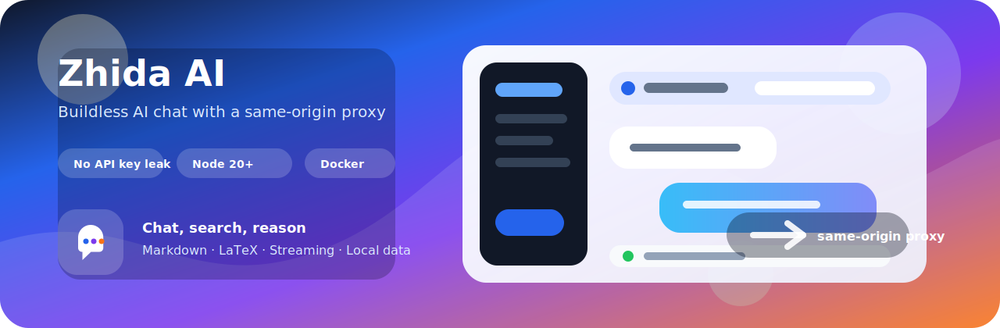
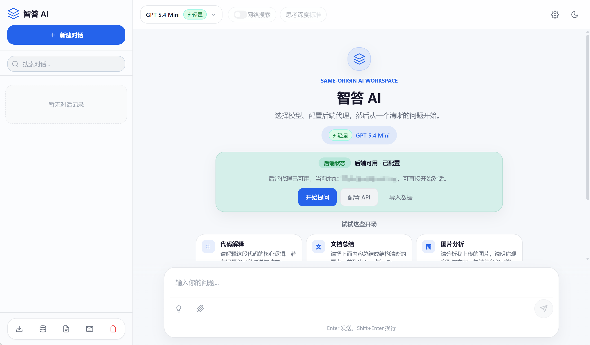
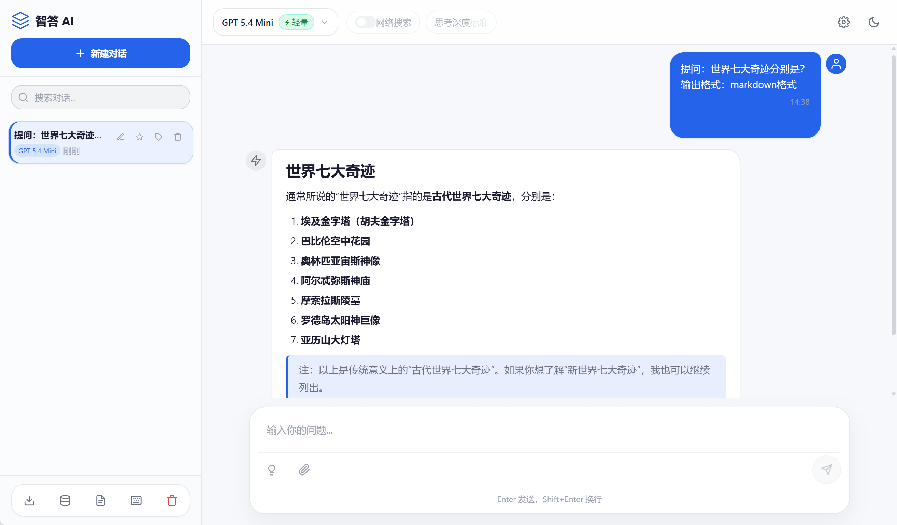
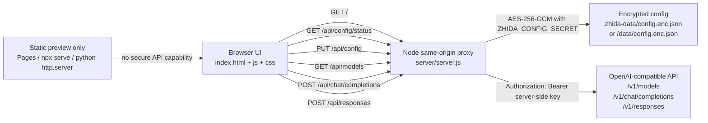

# 智答 AI

<p align="center">
  
</p>

<p align="center">
  <strong>零前端构建依赖的 AI 对话 Web 应用</strong><br>
  同源 Node.js 后端代理、多模型切换、Responses 网络搜索、流式响应、会话管理与本地优先体验。
</p>

<p align="center">
  <a href="https://github.com/ShuaiShuai03/zhida-ai/actions/workflows/ci.yml"></a>
  <a href="LICENSE"></a>
  
  
  
</p>

> [!IMPORTANT]
> **安全边界不可降级。** 浏览器只能请求同源 `/api/models`、`/api/chat/completions` 和 `/api/responses` 等受控路由。API 密钥绝不能出现在浏览器 `localStorage`、前端请求头、备份 JSON、静态托管配置或公开仓库中。

## ✨ 功能一览

| 模块 | 能力 | 说明 |
|------|------|------|
| 💬 对话 | 多轮上下文、SSE 流式输出、停止生成、重新生成 | 默认走同源 Node 代理，不让浏览器直连上游 API |
| 🧠 模型 | 默认模型、自定义模型、会话级模型记忆、模型能力识别 | 根据模型能力启用 Chat Completions、Responses、Web Search 和推理深度 |
| 🔎 工具 | Responses API 网络搜索、URL citation 来源链接 | 不支持 Responses 的模型会禁用相关控件并给出明确提示 |
| 📝 内容 | Markdown、代码高亮、LaTeX、思考过程展示 | AI 返回内容会经过自定义 HTML 清洗器 |
| 🗂️ 管理 | 搜索、置顶、标签、重命名、删除、清空、Markdown 导出 | 会话和非敏感设置保存在浏览器本地 |
| 🧩 模板 | 内置提示词模板、自定义模板增删改 | 插入模板只填入输入框，不会自动发送 |
| 📎 输入 | 文本、图片、代码/文本文件、拖拽、粘贴图片 | 文件大小限制见“文件与图片上传” |
| 🎨 体验 | 欢迎引导、紧凑会话侧边栏、深浅色主题、响应式布局、快捷键 | 圆角现代聊天工作区，桌面和移动端均可直接使用 |
| 🚢 部署 | Node 后端代理、Docker 后端代理、静态预览 | 静态托管只适合查看界面，不能安全提供真实聊天能力 |

## 为什么选择 Zhida AI？

| 亮点 | 价值 |
|------|------|
| **打开即用** | 没有前端构建链路；启动 Node 代理后直接访问浏览器页面。 |
| **代理边界清晰** | 上游 API 地址和密钥只进入服务端；浏览器只访问同源 `/api/*`。 |
| **兼容 OpenAI 风格接口** | 支持 Chat Completions、Responses、模型列表和 SSE。 |
| **适合自托管** | 本地默认绑定 `127.0.0.1`，Docker Compose 默认只暴露到宿主机回环地址。 |
| **质量门禁轻量** | 不依赖 npm install；文档、语法、单测、浏览器 smoke 和 Docker 校验都有现成命令。 |

## 界面预览 / Runtime Screenshots

以下截图来自真实本地运行界面，展示当前的欢迎引导、后端状态提示、提示词建议卡片、紧凑会话侧边栏、模型选择器和圆角聊天工作区。

<p align="center">
  <strong>Welcome / onboarding screen</strong><br>
  
</p>

<p align="center">
  <strong>Chat workspace screen</strong><br>
  
</p>

## 快速开始

### 1. 克隆仓库

```bash
git clone https://github.com/ShuaiShuai03/zhida-ai.git
cd zhida-ai
```

### 2. 启动 Node 后端代理（推荐）

```bash
ZHIDA_CONFIG_SECRET="change-this-to-a-long-random-secret" \
ZHIDA_PORT=3000 \
node server/server.js
```

也可以使用脚本启动：

```bash
ZHIDA_CONFIG_SECRET="change-this-to-a-long-random-secret" bash scripts/start.sh 3000
```

### 3. 在浏览器配置 API

打开 `http://localhost:3000`，点击右上角 **设置**，填写 API 地址和 API 密钥，然后点击 **保存配置并获取模型列表**。

| 字段 | 说明 | 示例 |
|------|------|------|
| API 地址 | OpenAI 兼容接口基础 URL，由后端代理使用，可带或不带尾部 `/v1` | `https://api.openai.com` 或 `https://api.openai.com/v1` |
| API 密钥 | 用于服务端代理访问上游 API；保存成功后输入框清空 | `sk-...` |
| 系统提示词 | 自定义模型行为 | `你是一个严谨的代码审查助手。` |
| 温度 | 控制输出随机性 | `0.7` |
| 最大回复长度 | 限制单次回复 token 数 | `4096` |

> [!TIP]
> API 地址会在后端归一化，`https://api.openai.com` 和 `https://api.openai.com/v1` 都会正确映射到 `/v1/*` 上游路径，避免重复拼接 `/v1`。

## 安全模型

> [!CAUTION]
> GitHub Pages、`npx serve . -p 3000`、`python3 -m http.server 3000` 和任何纯静态托管都不能隐藏 API 密钥，也没有 `/api/config/status`、`PUT /api/config`、`/api/models`、`/api/chat/completions`、`/api/responses` 或 Responses 取消能力。它们只适合查看界面；真实聊天必须运行 Node 后端代理。

| 安全边界 | 当前行为 |
|----------|----------|
| 浏览器请求范围 | 浏览器只请求同源后端路由，不直接访问上游 API。 |
| API 密钥存储 | API 密钥不会写入 `localStorage`、前端请求头、备份 JSON 或静态托管文件。 |
| 配置保存 | `PUT /api/config` 把 API 地址和密钥提交给同源 Node 后端。 |
| 服务端加密 | 后端使用 `ZHIDA_CONFIG_SECRET` 派生 AES-256-GCM 密钥，加密保存本地配置。 |
| 本地默认绑定 | `node server/server.js` 默认监听 `127.0.0.1`。 |
| Docker 默认暴露 | `docker-compose.proxy.yml` 默认发布到 `${ZHIDA_HOST_IP:-127.0.0.1}:${ZHIDA_HOST_PORT:-3000}`。 |
| 测试页 | `/tests/smoke.html` 默认 404；只有显式 `ZHIDA_ENABLE_TEST_ROUTES=1` 才开放。 |
| 后端源码 | `server/server.js`、服务端配置文件和隐藏路径不会作为静态资源公开。 |
| Markdown 清洗 | 自定义 HTML 清洗器移除危险标签、危险属性和 unsafe inline style；仍不能承诺防御所有 XSS 向量。 |

服务端信任边界也要明确：拥有服务器进程权限和 `ZHIDA_CONFIG_SECRET` 的人可以解密本地配置文件。生产部署应使用足够长且随机的 `ZHIDA_CONFIG_SECRET`，并通过 HTTPS 提交配置。

## 运行日志

Node 后端以结构化 JSON 行（JSON Lines）输出日志，便于直接对接 `docker logs`、journald 或日志采集管道。`info` 和 `warn` 写入 stdout，`error` 写入 stderr。每行都包含 `ts`（ISO 8601 时间戳）、`level` 和 `event` 字段。

| 事件 | 级别 | 主要字段 | 触发时机 |
|------|------|----------|----------|
| `server_start` | info | `port`、`config_status` | 服务启动监听完成；`config_status` 为 `configured` 或 `not`。 |
| `request` | info | `method`、`path` | 收到任意请求。 |
| `not_found` | warn | `method`、`path` | 静态资源或未知 `/api/*` 路由返回 404。 |
| `body_limit_rejected` | warn | `method`、`path`、`limit`、`content_length` | 请求体超过对应路由上限，返回 413。 |
| `config_saved` | info | `method`、`path` | `PUT /api/config` 成功保存配置。 |
| `config_save_error` | error | `method`、`path`、`error` | 配置保存失败。 |
| `proxy_start` | info | `method`、`path`、`upstream_path` | 代理请求开始。 |
| `proxy_done` | info | `+ status`、`duration_ms` | 代理请求成功完成。 |
| `proxy_abort` | warn | `+ reason`、`duration_ms` | 代理请求因客户端断开、超时或请求体超限终止。 |
| `proxy_error` | error | `+ error`、`status?`、`duration_ms` | 代理请求出错或上游返回非 2xx。 |

> [!NOTE]
> 代理事件中 `path` 是浏览器请求的同源路径（如 `/api/chat/completions`），`upstream_path` 是转发到上游的路径（如 `/v1/chat/completions`）；同一次请求的 `proxy_start` 与终止事件成对出现。日志会从错误信息中移除 `ZHIDA_CONFIG_SECRET` 和上游 API 密钥，并把过长信息截断到 500 字符，但日志内容仍应按敏感运维数据对待，不要公开暴露。当前没有日志级别开关，每个请求都会产生一条 `info` 记录。

## 架构 / 请求流



### API 路由映射

| 浏览器请求 | 上游请求 | 说明 |
|------------|----------|------|
| `GET /api/config/status` | 本地配置状态 | 只返回脱敏状态，不返回密钥。 |
| `PUT /api/config` | 本地加密保存 | 保存 API 地址和密钥，要求 `ZHIDA_CONFIG_SECRET`。 |
| `GET /api/models` | `${apiBaseUrl}/v1/models` | 获取模型列表。 |
| `POST /api/chat/completions` | `${apiBaseUrl}/v1/chat/completions` | 普通聊天和流式响应。 |
| `POST /api/responses` | `${apiBaseUrl}/v1/responses` | Responses、网络搜索、推理深度。 |
| `POST /api/responses/:id/cancel` | `${apiBaseUrl}/v1/responses/:id/cancel` | 取消 Responses 请求。 |

浏览器不会直接访问上游 API，也不会向上游发送 `Authorization`。所有上游认证都由 Node 后端用加密保存的配置完成。

## Docker 部署

### 后端代理模式（可真实聊天）

```bash
ZHIDA_CONFIG_SECRET="change-this-to-a-long-random-secret" \
docker compose -f docker-compose.proxy.yml up -d
```

访问 `http://localhost:3000` 后在设置中填写 API 地址和密钥。

| 项目 | 默认行为 |
|------|----------|
| 容器镜像 | `Dockerfile.server`，运行同一个 `server/server.js`。 |
| 容器监听 | 镜像内 `ZHIDA_HOST=0.0.0.0`，只表示容器内部监听全部接口。 |
| 宿主机暴露 | Compose 默认 `${ZHIDA_HOST_IP:-127.0.0.1}:${ZHIDA_HOST_PORT:-3000}:3000`。 |
| 配置持久化 | Docker 卷 `zhida-ai-config` 挂载到 `/data`。 |
| 配置路径 | `/data/config.enc.json`。 |
| 旧配置兼容 | 首次升级且新路径不存在时，会只读回退 `/app/server/data/config.enc.json` 或 `LEGACY_DOCKER_CONFIG_PATH`。 |

> [!WARNING]
> 如果设置 `ZHIDA_HOST_IP=0.0.0.0`，宿主机所有网卡都会暴露该端口。请只在受控内网中使用，或放在带认证、限流和 HTTPS 的反向代理之后。公开暴露的后端代理应被视为需要保护的服务入口。

### 静态 Docker 模式（仅界面预览）

仓库也保留 `Dockerfile` 和 `docker-compose.yml`，它们提供 Nginx 静态页面预览：

```bash
docker compose up -d
```

这个模式不提供同源 `/api/*` 后端能力，不能保存或隐藏 API key，也不能用于真实聊天。

## 环境变量

下表以 `server/server.js`、`Dockerfile.server` 和 `docker-compose.proxy.yml` 当前读取的变量为准。服务端读取 `ZHIDA_PORT` 和 `ZHIDA_CONFIG_PATH`；裸名 `PORT`、`CONFIG_PATH` 不是受支持的别名。

| 变量 | 是否必填 | 默认 | 说明 |
|------|----------|------|------|
| `ZHIDA_CONFIG_SECRET` | 是；`scripts/start.sh` 和 Docker Compose 会强制要求。直接运行 `node server/server.js` 时不会启动前预检，但没有它无法保存或读取 API 密钥。 | 无 | API 配置加密密钥；代码接受任意非空字符串，生产环境建议使用至少 16 字符的随机值。必须保密，不要设为空字符串，不要提交到仓库或镜像。 |
| `ZHIDA_HOST` | 否 | 本地默认 `127.0.0.1`；`Dockerfile.server` 设置为 `0.0.0.0` | Node 后端监听地址。接受 Node.js `server.listen()` 支持的 host 字符串；空字符串或纯空白会回退到 `127.0.0.1`。设为 `0.0.0.0` 会监听所有可用网卡，公开暴露前必须放在受控网络或带 HTTPS、鉴权和限流的反向代理之后。 |
| `ZHIDA_PORT` | 否 | `3000` | Node 后端监听端口；必须是 `1` 到 `65535` 之间的整数。注意服务端读取的是 `ZHIDA_PORT`，不是 `PORT`。 |
| `ZHIDA_CONFIG_PATH` | 否 | 本地为 `.zhida-data/config.enc.json`；`Dockerfile.server` 和 Compose 设置为 `/data/config.enc.json` | 加密配置文件路径；接受文件路径字符串，保存时会创建父目录并以 `0600` 写入。用于 Docker 卷挂载时应指向持久化卷。该文件虽然已加密，仍不要提交到版本库或放到静态资源目录。注意服务端读取的是 `ZHIDA_CONFIG_PATH`，不是 `CONFIG_PATH`。 |
| `LEGACY_DOCKER_CONFIG_PATH` | 否 | `server/data/config.enc.json`；容器内对应 `/app/server/data/config.enc.json` | 旧 Docker 配置的只读兼容路径。仅在显式设置 `ZHIDA_CONFIG_PATH` 且需要迁移旧配置时读取；保存始终写入 `ZHIDA_CONFIG_PATH`。接受文件路径字符串。 |
| `ZHIDA_PROXY_TIMEOUT_MS` | 否 | `120000` | 上游代理超时，单位毫秒；必须是 `1` 到 `9007199254740991` 之间的整数。超时会在读取请求体、收到上游响应头、收到流式分片或完成写入等待后刷新。 |
| `ZHIDA_PROXY_MAX_BODY_BYTES` | 否 | 服务端默认 `26214400`（25 MiB）；Docker Compose 未设置时会传入 `10485760`（10 MiB） | `/api/chat/completions` 和 `/api/responses` 的请求体上限，单位字节；必须是 `1` 到 `9007199254740991` 之间的整数。它不适用于 `PUT /api/config`（固定 `262144` 字节）、`GET /api/models`、`POST /api/responses/:id/cancel` 或其他 `/api/*` 路由（这些路由使用 `524288` 字节上限），也不限制静态文件请求。 |
| `ZHIDA_ENABLE_TEST_ROUTES` | 否 | 未启用 | 测试页开关；只有字面量 `1` 会开放 `/tests/smoke.html`，其他值都视为关闭。不要在生产环境启用。 |
| `ZHIDA_HOST_IP` | 否；仅 Docker Compose 使用 | `127.0.0.1` | `docker-compose.proxy.yml` 发布到宿主机的绑定 IP，不会被 Node 服务端读取。设为 `0.0.0.0` 会让宿主机所有网卡暴露该端口，公开前必须加访问控制。 |
| `ZHIDA_HOST_PORT` | 否；仅 Docker Compose 使用 | `3000` | `docker-compose.proxy.yml` 暴露到宿主机的端口，不会被 Node 服务端读取；必须是 Docker 端口映射接受的宿主机端口值。 |
| `NODE_VERSION` | 否；仅 Docker 构建使用 | `22` | `Dockerfile.server` 的 Node 基础镜像版本构建参数。应使用可用的 Node Docker 镜像标签；项目要求 Node.js 20+。 |

配置路径兼容规则：

- 本地默认写入 `.zhida-data/config.enc.json`，该文件不在浏览器静态访问白名单内。
- 旧版 `server/data/config.enc.json` 会被只读兼容读取。
- Docker 后端代理写入 `/data/config.enc.json`。
- 若显式设置 `ZHIDA_CONFIG_PATH=/data/config.enc.json` 且该路径不存在，会先尝试读取 `/app/server/data/config.enc.json` 或 `LEGACY_DOCKER_CONFIG_PATH`，保存时始终写入 `ZHIDA_CONFIG_PATH`。

## 配置 API 与模型能力

上游 API 需要：

1. 提供 `/v1/chat/completions`。
2. 如需自动获取模型列表，还需要提供 `/v1/models`。
3. 如需使用网络搜索或 Responses 推理深度，还需要提供 `/v1/responses`。
4. 推荐支持标准 SSE 流式响应；如果服务返回 OpenAI 风格的普通 JSON 成功响应，应用会按非流式结果展示。

网络搜索与推理深度规则：

- 网络搜索使用 Responses API 的 `web_search` 工具。只有当前模型明确支持 Responses 时才会启用网络搜索开关。
- 如果 `/v1/models` 返回 `call_methods`、`callMethods` 或 `capabilities.call_methods`，应用以该字段为准；只有包含 `responses` 的模型才会允许网络搜索。
- 如果模型没有声明能力，第三方或 OpenAI-compatible 服务默认不启用 Responses / Web Search，避免把只支持 Chat Completions 的模型误发到 `/v1/responses`。
- 官方 OpenAI API 地址下的 GPT-5、GPT-4.1 和 o 系列按内置规则允许 Responses；支持推理深度的模型才会显示可用的“思考深度”控件。
- 不支持时应用不会伪造搜索、不会静默降级为普通聊天、也不会自动切换模型；发送前会阻止请求并提示用户切换支持网络搜索的模型。
- Responses 上游返回 `call_methods must include responses`、`does not support this API` 等能力错误时，后端会归一化为中文提示，并继续脱敏上游错误内容。

## 数据管理与输入

### 数据管理

- **提示词模板**：点击输入框右侧模板按钮或侧边栏 **提示词模板**，可插入内置模板，或创建、编辑、删除自定义模板。插入模板只会填入输入框，不会自动发送。
- **对话组织**：对话支持置顶和标签；搜索会匹配标题、消息内容、模型名和标签，也可以输入 `#标签名` 进行标签筛选。
- **备份恢复**：侧边栏 **数据管理** 可导出全部本地数据为 JSON，包含对话、当前激活对话、模型选择、模型缓存、非敏感设置、自定义模板、导出版本和 BJT 导出时间。备份不包含 API 密钥。
- **清理旧对话**：可配置保留数量，应用会优先保留置顶对话，普通对话按 `updatedAt` 从旧到新删除。
- **Markdown 导出**：单对话 Markdown 导出会包含模型、BJT 创建时间、置顶状态、标签和消息数。

### 模型列表

- 默认模型定义在 [js/config.js](js/config.js)。
- 保存 API 配置后，应用会通过同源 `/api/models` 刷新模型列表。
- 设置弹窗中的 **保存配置并获取模型列表** 会先把配置加密保存到后端，再同步更新实际对话模型下拉框。
- 切换历史对话时，应用会恢复该对话保存的模型，继续发送时不会被其他对话当前选中的模型覆盖。
- 如果历史会话保存的模型已经不在当前模型列表中，界面会显示“模型不可用”，并要求重新选择可用模型；不会静默替换成当前模型。

### 文件与图片上传

| 类型 | 支持内容 | 限制 |
|------|----------|------|
| 文本 / 代码文件 | `.txt`、`.md`、`.js`、`.ts`、`.jsx`、`.tsx`、`.py`、`.json`、`.csv`、`.html`、`.css`、`.xml`、`.yaml`、`.yml`、`.sh`、`.bat`、`.ps1`、`.sql`、`.go`、`.rs`、`.java`、`.c`、`.cpp`、`.h`、`.rb`、`.php`、`.log`、`.conf`、`.ini`、`.toml`、`.env`、`.swift`、`.kt`、`.scala`、`.r` | 单个不超过 `100 KB` |
| 图片 | `.png`、`.jpg`、`.jpeg`、`.gif`、`.webp`、`.bmp`、`.svg` | 单个不超过 `5 MB` |

支持点击上传、拖拽到输入区、以及在输入框中直接粘贴图片。

## 快捷键

| 快捷键 | 功能 |
|--------|------|
| `Enter` | 发送消息 |
| `Shift + Enter` | 换行 |
| `Ctrl/Cmd + N` | 新建对话 |
| `Ctrl/Cmd + Shift + S` | 切换侧边栏 |
| `Ctrl/Cmd + Shift + L` | 切换主题 |
| `Esc` | 关闭弹窗 / 停止生成 |
| 双击对话标题 | 重命名对话 |

## Validation / Quality Gates

本仓库提供无需额外依赖管理器的最小测试集：

```bash
# 文档和链接校验
python3 scripts/check_markdown.py

# JavaScript 语法校验
for f in js/*.js; do node --check "$f"; done; node --check server/server.js

# Shell 与 Python 脚本校验
bash -n scripts/start.sh scripts/run_smoke.sh
python3 -m py_compile scripts/check_markdown.py scripts/mock_api.py

# 纯逻辑和服务端单测
node --test tests/*.test.mjs

# 浏览器 smoke，需要本机可执行 google-chrome
bash scripts/run_smoke.sh

# Git 空白检查
git diff --check
```

浏览器 smoke 会启动本地 Node 后端和 mock API，并设置 `ZHIDA_ENABLE_TEST_ROUTES=1` 临时开放 `/tests/smoke.html`；普通运行环境默认不会暴露该测试页。它覆盖加密配置保存、模型获取、会话模型恢复、网络搜索禁用态、Responses `web_search`、推理深度、流式回答、停止生成、后续请求恢复、提示词模板、对话置顶/标签搜索、备份导入恢复、Markdown URL / inline style 清洗、复制内容一致性以及键盘可达性。

慢机器或 CI 环境可以增加 Chrome 等待时间：

```bash
CHROME_TIMEOUT=180s bash scripts/run_smoke.sh
```

Docker 相关检查：

```bash
docker build -f Dockerfile.server -t zhida-ai-proxy-check .
ZHIDA_CONFIG_SECRET="compose-check-secret" docker compose -f docker-compose.proxy.yml config
```

## 项目结构

```text
zhida-ai/
├── index.html
├── css/
├── js/
│   ├── api.js
│   ├── app.js
│   ├── backup-utils.js
│   ├── chat.js
│   ├── config.js
│   ├── conversation-utils.js
│   ├── long-text.js
│   ├── markdown.js
│   ├── prompt-templates.js
│   ├── state.js
│   ├── storage.js
│   ├── theme.js
│   ├── ui.js
│   └── utils.js
├── assets/
│   ├── favicon.svg
│   ├── readme/
│   └── screenshots/
│       ├── chat-showcase.png
│       └── welcome-showcase.png
├── scripts/
│   ├── check_markdown.py
│   ├── mock_api.py
│   ├── run_smoke.sh
│   ├── start.ps1
│   └── start.sh
├── server/
│   └── server.js
├── tests/
│   ├── app-features.test.mjs
│   ├── conversation-utils.test.mjs
│   ├── server.test.mjs
│   └── smoke.html
├── .github/
├── Dockerfile
├── Dockerfile.server
├── docker-compose.yml
├── docker-compose.proxy.yml
├── CONTRIBUTING.md
├── CODE_OF_CONDUCT.md
├── SECURITY.md
└── LICENSE
```

## 技术栈

| 技术 | 用途 |
|------|------|
| HTML5 + CSS3 + ES Modules | 前端应用主体 |
| [marked.js](https://github.com/markedjs/marked) | Markdown 解析 |
| [highlight.js](https://highlightjs.org/) | 代码高亮 |
| [KaTeX](https://katex.org/) | 数学公式渲染 |
| Node.js 20+/22+ 内置 `http` / `fetch` / `crypto` | 静态服务、配置加密和 API 代理 |
| Nginx | 静态 Docker 预览 |
| Google Chrome Headless | 浏览器 smoke 测试 |

运行时会从 CDN 加载 `marked.js`、`highlight.js` 和 `KaTeX`。如果部署环境不能访问这些 CDN，需要自行 vendoring 或替换为可访问的静态资源。

## Roadmap

- 补充更多真实运行预览，例如移动端截图或短录屏。
- 为更多 OpenAI-compatible 服务补充模型能力识别样例。
- 补充反向代理部署示例，包括 HTTPS、鉴权和限流建议。
- 在不暴露密钥的前提下增强配置状态诊断。

## 常见问题

<details>
<summary><strong>Q: 为什么直接打开 index.html 后页面空白？</strong></summary>

本项目使用 ES Modules（`<script type="module">`），`file://` 协议下模块和部分浏览器能力不可用。请通过 HTTP 服务器访问。需要真实聊天时请运行 `ZHIDA_CONFIG_SECRET="..." node server/server.js`；只看界面时才使用 `python3 -m http.server 3000` 等静态服务器。
</details>

<details>
<summary><strong>Q: 为什么配置正确仍然请求失败？</strong></summary>

请确认你正在运行 `node server/server.js` 或 `scripts/start.sh`，并且设置了 `ZHIDA_CONFIG_SECRET`。`npx serve . -p 3000`、`python3 -m http.server 3000` 和 GitHub Pages 只是纯静态服务器，没有同源 `/api/*` 后端能力，不能保存 API key、获取模型列表或完成聊天请求。
</details>

<details>
<summary><strong>Q: 如何连接本地 Ollama？</strong></summary>

如果 Node 后端和 Ollama 在同一台机器，可将 API 地址填写为 `http://localhost:11434`，密钥可填任意值（例如 `ollama`）。如果 Node 后端部署在远程服务器，而 Ollama 只监听你本机回环地址，后端将无法连通。
</details>

<details>
<summary><strong>Q: 对话数据存在哪里？</strong></summary>

会话、模型缓存、主题和非敏感设置保存在浏览器 `localStorage` 中。API 密钥加密保存在 Node 后端的配置文件里；清除站点数据不会删除服务端加密配置。
</details>

<details>
<summary><strong>Q: 可以隐藏 API 密钥吗？</strong></summary>

可以。当前版本只支持服务端代理调用上游 API；浏览器不会持久化或向上游发送 API 密钥。需要注意的是，拥有服务器进程权限和 `ZHIDA_CONFIG_SECRET` 的人仍可解密配置，这是服务端代理模式的正常信任边界。
</details>

## 贡献

欢迎贡献。请阅读 [CONTRIBUTING.md](CONTRIBUTING.md) 了解开发约定、测试命令和提交流程。安全问题请优先阅读 [SECURITY.md](SECURITY.md)，不要在公开 Issue 中披露漏洞细节。

## 许可证

[MIT License](LICENSE)
